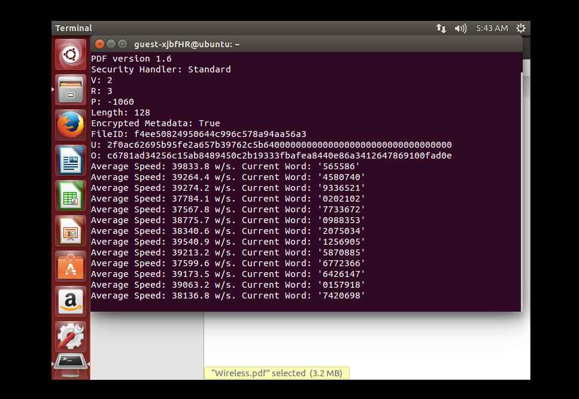

# cyber-security

## Demonstrations
We have coverd all the fundamentals of digital security and vulnerability here. Your personal PC and password protection, ethical hacking, Penetration, linux foundation, email encryption, software in use, focus on secure web development, social media vulnerability, digital pickpocketing. We have so much to do to protect our digital world. 
